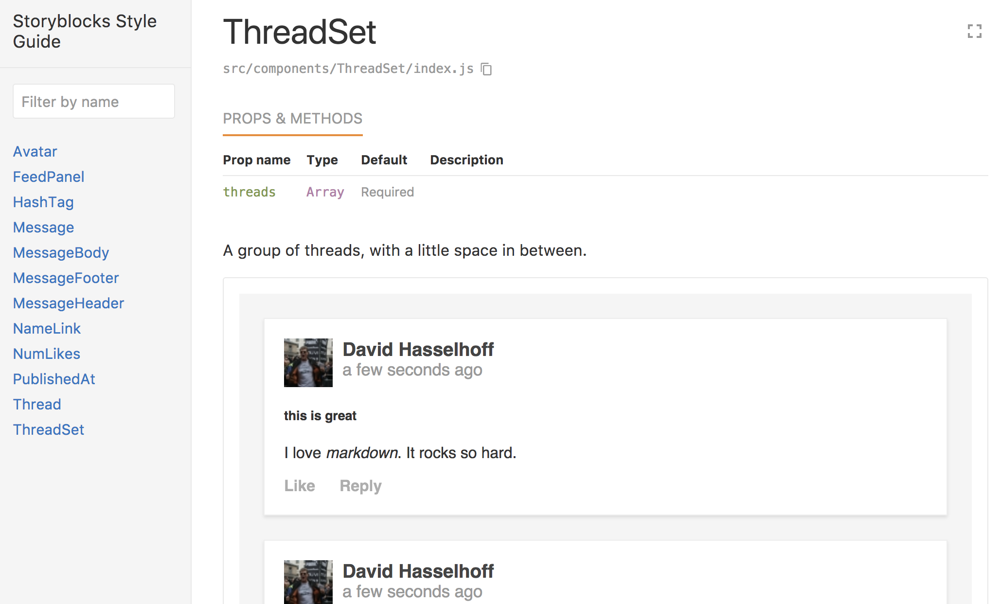

# Storyblocks

This is a silly name and should be changed.

This package contains React components that are a clone of UI elements used in the [Patchwork](https://github.com/ssbc/patchwork) client for [Scuttlebutt](https://www.scuttlebutt.nz/).

This is mainly intended for experimentation purposes. It is not an alternative UI, nor is it necessarily better than the UI provided by the patchwork codebase.

## Installing

Clone this package and install the npm packages with yarn or npm.

## Exploring

This project ships with an interactive styleguide.



You can run it on your computer with:

```bash
yarn run styleguide
```

## Development

This project was bootstrapped with [Create React App](https://github.com/facebookincubator/create-react-app).

You can find a detailed development guide [here](https://github.com/facebookincubator/create-react-app/blob/master/packages/react-scripts/template/README.md).